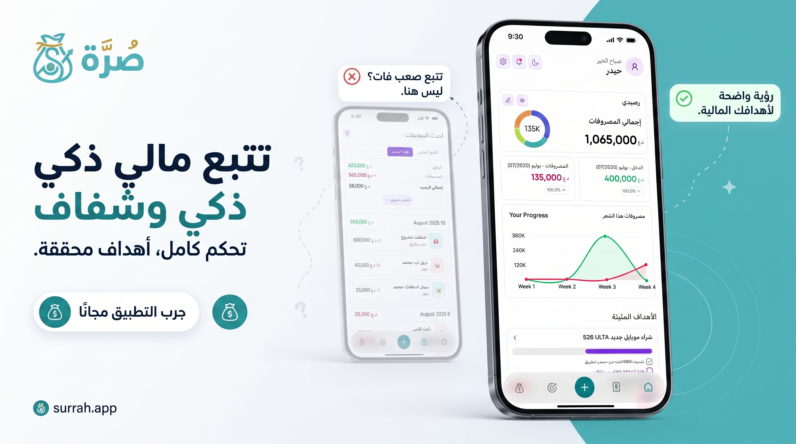
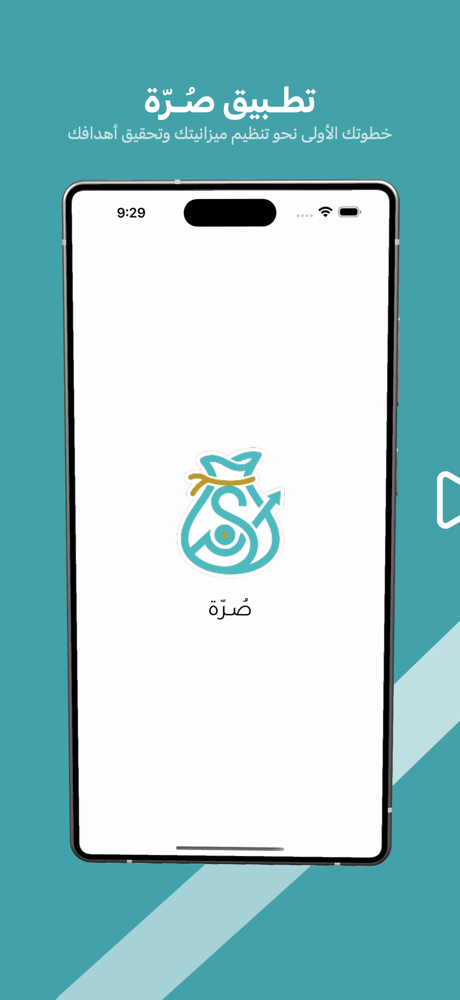
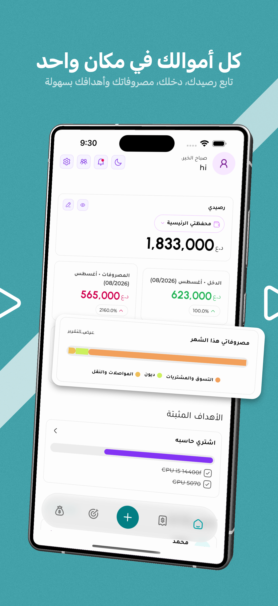
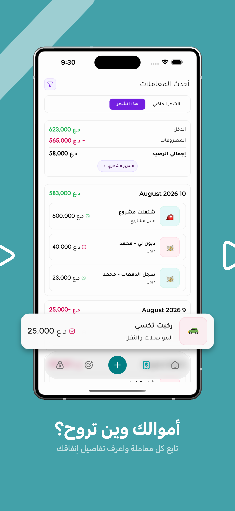
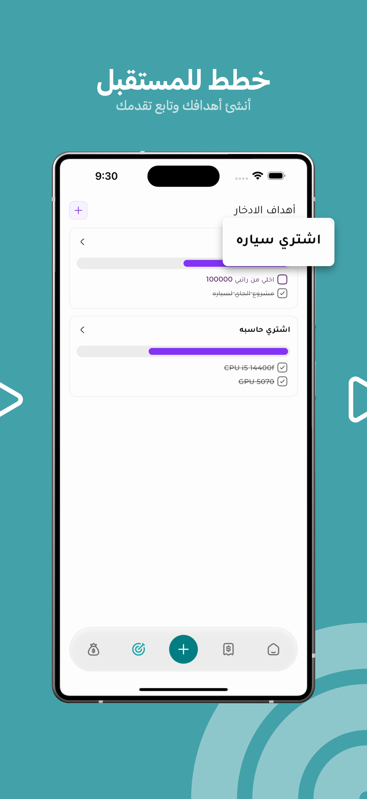
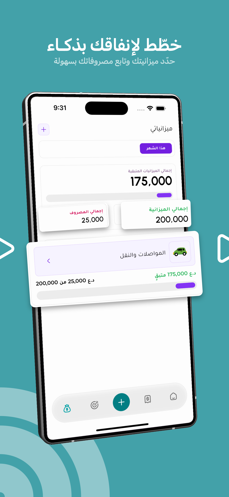
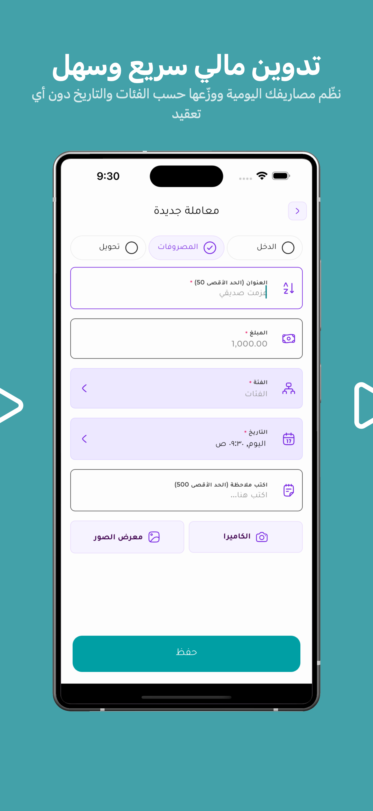

# 💼 تطبيق صُـرّة (Surrah) | المساعد المالي الذكي والمجاني

<div align="center">



### **خطوتك الأولى نحو تنظيم ميزانيتك، إدارة مصاريفك، وتحقيق أهدافك المالية**

[](https://flutter.dev)
[](https://dart.dev)
[](https://github.com)
[](https://github.com)
[](https://github.com)

---

</div>

## 📌 عن التطبيق (About Surrah)

**تطبيق صُـرّة (Surrah)** هو تطبيق متكامل وحديث لإدارة المصاريف والميزانيات المالية الشخصية وميزانيات المشاريع الصغيرة، صُمم خصيصاً ليمنحك تجربة استخدام فائقة السهولة والجمال مع الحفاظ الكامل على **خصوصيتك وأمان بياناتك (Offline-First & Local-First)** دون الحاجة لأي تسجيل حساب أو مشاركة بياناتك مع أطراف خارجية.

يساعدك **صُـرّة** على التخلص من تعقيدات جداول الإكسل وتشتت الحسابات، ليجمع كل أموالك، محافظك، ديونك، ميزانياتك، وأهدافك المالية المستقبلية في واجهة عصرية ومريحة تدعم الوضعين الداكن والفاتح، واللغتين العربية والإنجليزية، وتنسيقات العملات المتعددة (مثل الدينار العراقي `د.ع`، الدولار الأمريكي `$`، وغيرها).

---

## 📱 جولة بصرية داخل التطبيق (App Screenshots)

<div align="center">
<table>
  <tr>
    <td align="center" width="33.33%">
      
      <br />
      <b>1️⃣ الواجهة الترحيبية والهوية</b>
      <p><i>خطوتك الأولى نحو الاستقرار والوعي المالي</i></p>
    </td>
    <td align="center" width="33.33%">
      
      <br />
      <b>2️⃣ كل أموالك في مكان واحد</b>
      <p><i>متابعة الرصيد، الدخل، المصروفات، والتقدم الشهري</i></p>
    </td>
    <td align="center" width="33.33%">
      
      <br />
      <b>3️⃣ أموالك وين تروح؟</b>
      <p><i>سجل المعاملات المالي، الديون، وتفاصيل الإنفاق</i></p>
    </td>
  </tr>
  <tr>
    <td align="center" width="33.33%">
      
      <br />
      <b>4️⃣ خطط للمستقبل</b>
      <p><i>أهداف الادخار مع قوائم فرعية وتتبع للإنجاز</i></p>
    </td>
    <td align="center" width="33.33%">
      
      <br />
      <b>5️⃣ خطّط لإنفاقك بذكاء</b>
      <p><i>ميزانيات لكل فئة مع تتبع المتبقي والمصروف</i></p>
    </td>
    <td align="center" width="33.33%">
      
      <br />
      <b>6️⃣ تدوين مالي سريع وبديهي</b>
      <p><i>إضافة المصاريف والدخل والتحويلات مع دعم الصور والملاحظات</i></p>
    </td>
  </tr>
</table>
</div>

---

## ✨ أبرز المميزات والخصائص (Key Features)

### 📊 1. لوحة تحكم شاملة ومباشرة (Dashboard & Cash Flow)
- **ملخص مالي فوري:** عرض الرصيد الإجمالي، مجموع الدخل، ومجموع المصاريف للشهر الحالي بنسب مقارنة واضحة.
- **توزيع المصاريف البصري:** مخطط ملون وواضح يوضح توزيع نفقاتك على الفئات المختلفة (تسوق، مواصلات، التزامات، ديون، وغيرها).
- **أهداف مثبتة:** وصول سريع ومباشر لأهم أهدافك المالية من الشاشة الرئيسية لمتابعة تحقيقها خطوة بخطوة.

### 💸 2. تدوين سريع ومرن للمعاملات (Smart Transactions)
- **دعم كافة أنواع العمليات:** تسجيل سهل للمصروفات (*Expense*)، الدخل (*Income*)، والتحويل بين المحافظ (*Transfer*).
- **إرفاق الصور والملاحظات:** إمكانية التقاط صورة للفاتورة أو الإيصال من الكاميرا أو معرض الصور وربطها بالمعاملة مع كتابة ملاحظات مفصلة.
- **تصنيف دقيق وتلقائي:** ربط المعاملة بالفئات والمحافظ المحددة وحساب الأثر المالي فوراً.

### 🎯 3. أهداف الادخار والمشتريات المخططة (Savings Goals & Planned Purchases)
- **تحديد الأهداف المالية:** إنشاء أهداف ادخارية (مثل: شراء سيارة، تجميع حاسوب، صندوق الطوارئ).
- **قوائم فرعية تفاعلية (Checklists):** تقسيم الهدف إلى بنود تفصيلية وتحديد تكلفة كل بند والتحقق منها تدريجياً.
- **مشتريات مخططة:** جدولة المشتريات القادمة وإدارتها وتأكيد شرائها عند الدفع.

### 📉 4. إدارة الميزانيات الذكية (Budgets & Limits)
- **ميزانية مخصصة لكل فئة:** حدد سقفاً للإنفاق في فئات معينة (مثل: المواصلات، المطاعم، التسوق).
- **مؤشرات تقدم حية:** متابعة النسبة المستهلكة والمبلغ المتبقي لحمايتك من تجاوز ميزانيتك المحددة.
- **ميزانيات روتينية دورية:** تجديد الميزانية تلقائياً كل شهر أو أسبوع دون الحاجة لإعادة ضبطها يدوياً.

### 🤝 5. إدارة الديون والالتزامات (Debts Management)
- **ديون لك وديون عليك:** متابعة دقيقة للمبالغ التي أقرضتها للآخرين أو المستحقة عليك.
- **سجل الدفعات والتسديد الجزئي:** تسجيل دفعات السداد وتتبع المتبقي من كل دين مع تاريخ الاستحقاق.

### 🌙 6. الخمس الشرعي والحسابات الخاصة (Khums Calculation)
- **ميزة متخصصة وحصرية:** حساب ومتابعة رأس السنة الخمسية والمستحقات الشرعية بشكل دوري ودقيق.

### 👛 7. تعدد المحافظ والعملات (Multi-Wallet & Multi-Currency)
- **محافظ غير محدودة:** إدارة المحفظة النقدية (Cash)، الحسابات البنكية، والمحافظ الرقمية.
- **تخصيص العملة لكل محفظة:** دعم مرن لمختلف العملات مع إمكانية تحديد عملة خاصة بكل حساب/محفظة.

### 🔒 8. خصوصية تامة وأمان محلي (Offline & Local First)
- **بياناتك ملكك بالكامل:** يتم تخزين جميع السجلات على ذاكرة جهازك المحلية عبر قاعدة بيانات SQLite سريعة وآمنة (Drift).
- **نسخ احتياطي واستعادة:** تصدير نسخة احتياطية مشفرة بضغطة زر وحفظها على هاتفك واستعادتها في أي وقت.
- **بدون إنترنت وبدون إعلانات:** التطبيق يعمل بكامل طاقته بدون اتصال بالإنترنت، وخالٍ تماماً من أي إعلانات مزعجة.

### 🎨 9. تخصيص المظهر وتعدد اللغات (Theming & Localization)
- **الوضع الداكن والفاتح (Dark & Light Mode):** واجهات عصرية تدعم الوضع الليلي لحماية عينيك وتوفير طاقة البطارية.
- **دعم كامل للغة العربية والإنجليزية:** نصوص واضحة وتصميم يدعم الـ RTL و LTR بشكل احترافي.

---

## 🛠️ البنية البرمجية والتقنيات المستخدمة (Tech Stack)

تم بناء التطبيق وفق أفضل الممارسات البرمجية الحديثة في بيئة **Flutter** لضمان الأداء العالي وسهولة التوسع:

* **Framework:** [Flutter](https://flutter.dev) (Dart 3.8+)
* **Architecture:** Feature-First Clean Architecture (Domain / Data / Presentation)
* **State Management:** [Riverpod](https://riverpod.dev)
* **Local Database:** [Drift (SQLite)](https://drift.simonbinder.eu/) + `drift_flutter`
* **UI & Components:** [ResponsiveFramework](https://github.com/Codelessly/ResponsiveFramework), `fl_chart`, `auto_size_text`
* **Localization:** Flutter Localization (`intl`, `app_ar.arb`, `app_en.arb`)
* **Analytics & Performance:** Firebase Crashlytics, Firebase Performance (مجهولة الهوية)

---

## 📂 الهيكل العام للمشروع (Project Structure)

```text
lib/
├── core/                       # المكونات المشتركة، الثيمات، إدارة الأخطاء، والتوجيه
│   ├── database/               # جداول Drift وقواعد البيانات المحلية
│   ├── router/                 # إدارة التنقل ومسارات الصفحات
│   ├── theme/                  # منظومة الألوان والخطوط والأشكال
│   └── utils/                  # الأدوات المساعدة والمحولات
├── features/                   # ميزات التطبيق (مقسمة حسب النطاق الوظيفي)
│   ├── dashboard/              # لوحة التحكم الرئيسية وملخص الحسابات
│   ├── transaction/            # إدارة المعاملات المالية وتفاصيلها
│   ├── budget/                 # إدارة ومتابعة الميزانيات
│   ├── goal/                   # أهداف الادخار والتخطيط المالي
│   ├── planned_purchases/      # المشتريات المجدولة والمخططة
│   ├── debt/                   # إدارة الديون والسداد
│   ├── khums/                  # حساب الخمس ومتابعة المستحقات
│   ├── wallet/                 # المحافظ والحسابات المالية
│   ├── category/               # فئات المصاريف والإيرادات
│   ├── backup_and_restore/     # النسخ الاحتياطي والاسترجاع
│   ├── reports/                # التقارير والإحصائيات الشهرية والسنوية
│   └── settings/               # التفضيلات والمظهر واللغات
├── l10n/                       # ملفات الترجمة المحلية (العربية والإنجليزية)
└── main.dart                   # نقطة انطلاق التطبيق
```

---

## 🚀 التشغيل والتطوير (Getting Started)

لتشغيل المشروع محلياً والمساهمة في تطويره:

### 1. المتطلبات الأساسية
- تثبيت [Flutter SDK](https://docs.flutter.dev/get-started/install) (الإصدار 3.8.0 أو أحدث).
- بيئة تطوير: [Android Studio](https://developer.android.com/studio) أو [VS Code](https://code.visualstudio.com/) مع إضافات Flutter & Dart.

### 2. تثبيت المشروع
```bash
# استنساخ المستودع
git clone https://github.com/layground/pockaw.git

# الانتقال لمجلد المشروع
cd pockaw

# تنزيل الحزم والاعتماديات
flutter pub get

# توليد ملفات قاعدة البيانات والنماذج (Code Generation)
dart run build_runner build --delete-conflicting-outputs
```

### 3. تشغيل التطبيق
```bash
flutter run
```

---

## 🤝 المساهمة (Contributing)

نرحب بكافة المساهمات من مجتمع المطورين! سواء كان ذلك عبر الإبلاغ عن أخطاء، اقتراح أفكار جديدة، أو إرسال طلبات سحب (Pull Requests):

1. قم بعمل **Fork** للمشروع.
2. أنشئ فرعاً لميزتك (`git checkout -b feature/AmazingFeature`).
3. قم بعمل Commit لتغييراتك (`git commit -m 'Add some AmazingFeature'`).
4. ارفع الفرع (`git push origin feature/AmazingFeature`).
5. افتح **Pull Request**.

---

## 📜 الترخيص (License)

هذا المشروع مفتوح المصدر ومرخص تحت رخصة **GNU Lesser General Public License v3.0 (LGPL v3)**.

<div align="center">
صُنِع بكل ❤️ ليكون رفيقك المالي الدائم.
</div>
